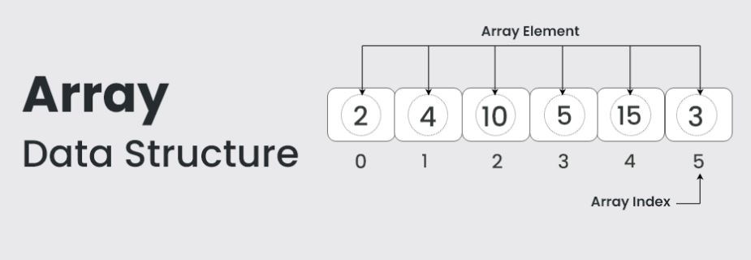

## Array Introduction:

1. [Introduction](#arrayIntro)
2. [Implementation in different languages]()
3. [Basic Operations]()
4. [Standard problem on Array](#arrayProblemSolving)

<div id="arrayIntro">

- An array data structure is a fundamental concept in computer science that stores a collection of elements in a contiguous block of memory. It allows for efficient access to elements using indices and is widely used in programming for organizing and manipulating data.

- In other words: An array is a collection of items of same data type stored at contiguous memory locations.

- Basic terminologies of array
  a. Array Index: In an array, elements are identified by their indexes. Array index starts from 0.
  b. Array element: Elements are items stored in an array and can be accessed by their index.
  c. Array Length: The length of an array is determined by the number of elements it can contain.

<div align="center">
  
</div>

<div id="arrayProblemSolving">

## Question 1: Two Sum

Given an array of integers nums and an integer target, return indices of the two numbers such that they add up to target.

You may assume that each input would have exactly one solution, and you may not use the same element twice.

You can return the answer in any order.

#### Example 1:

Input: nums = [2,7,11,15], target = 9
Output: [0,1]
Explanation: Because nums[0] + nums[1] == 9, we return [0, 1].
Example 2:

Input: nums = [3,2,4], target = 6
Output: [1,2]
Example 3:

Input: nums = [3,3], target = 6
Output: [0,1]

#### Constraints:

2 <= nums.length <= 104
-109 <= nums[i] <= 109
-109 <= target <= 109
Only one valid answer exists.

#### Follow-up: Can you come up with an algorithm that is less than O(n2) time complexity?

## Solution

```Javascript
// Brute Force Approach: This approach involves iterating through the array and checking every possible pair to see if they sum up to the target.

function twoSum(nums, target) {
    for (let i = 0; i < nums.length; i++) {
        for (let j = i + 1; j < nums.length; j++) {
            if (nums[i] + nums[j] === target) {
                return [i, j];
            }
        }
    }
}

```

```Javascript
// Using a Hash Map (Optimized Approach): This approach involves using a hash map to store the complements of each number as we iterate through the array. This allows us to find the complement of the current number efficiently.


function twoSum(nums, target) {
    const numMap = new Map();
    for (let i = 0; i < nums.length; i++) {
        const complement = target - nums[i];
        if (numMap.has(complement)) {
            return [numMap.get(complement), i];
        }
        numMap.set(nums[i], i);
    }
}


```

```Javascript
// Sorting Approach: This approach involves first sorting the array. Then, using two pointers, one starting from the beginning and the other from the end, we move them towards each other until we find the pair that sums up to the target.


function twoSum(nums, target) {
    const sortedNums = [...nums].sort((a, b) => a - b);
    let left = 0;
    let right = sortedNums.length - 1;

    while (left < right) {
        const sum = sortedNums[left] + sortedNums[right];
        if (sum === target) {
            return [nums.indexOf(sortedNums[left]), nums.lastIndexOf(sortedNums[right])];
        } else if (sum < target) {
            left++;
        } else {
            right--;
        }
    }
}


```

</div>
</div>
